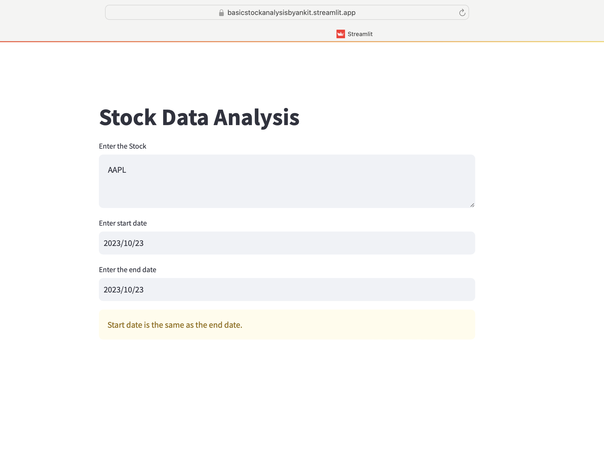
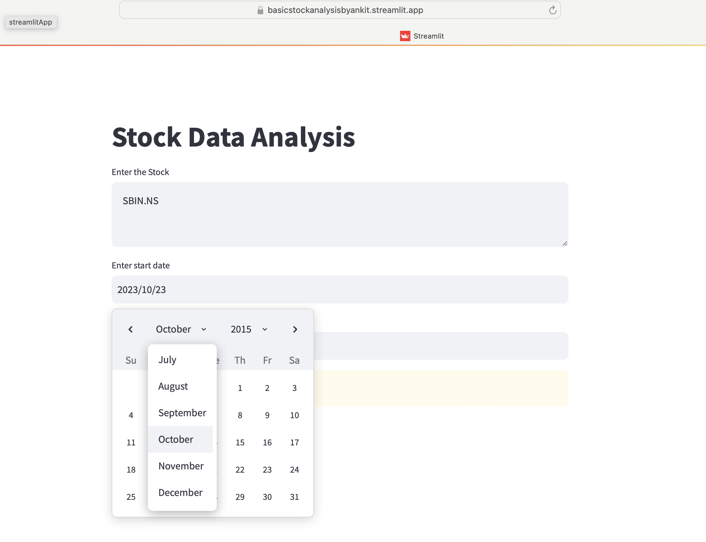
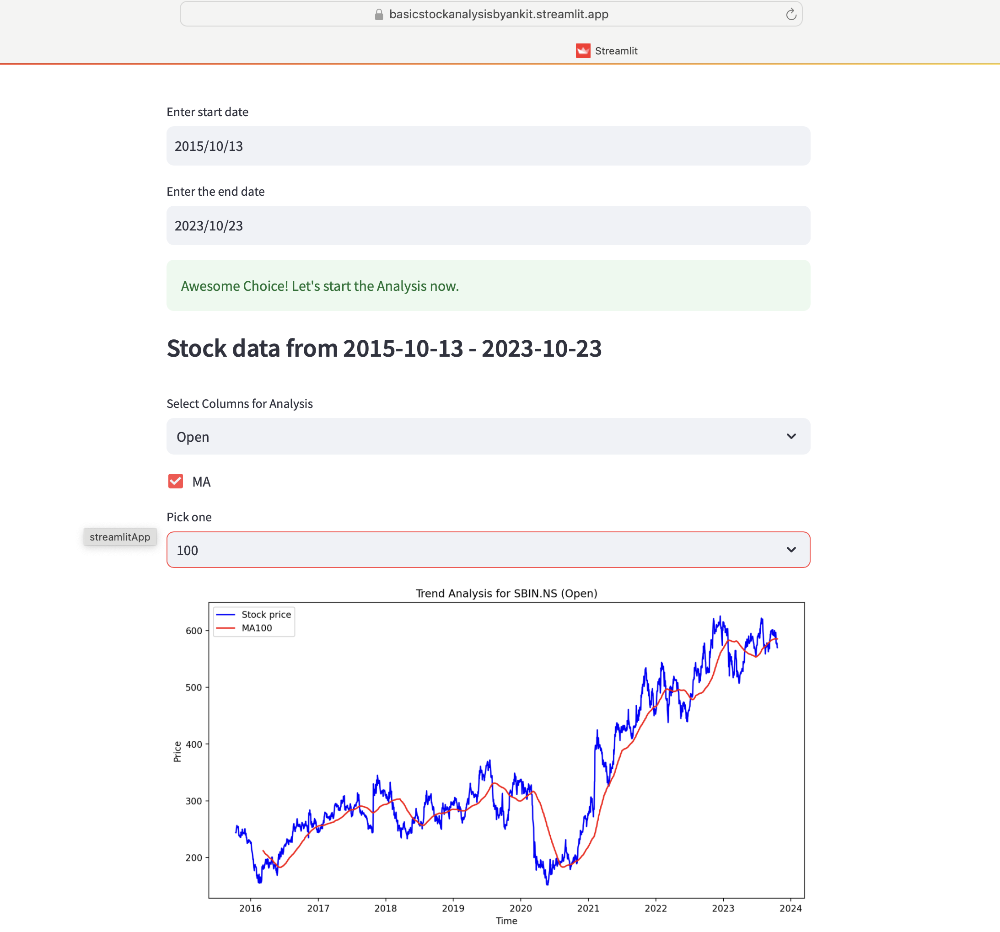
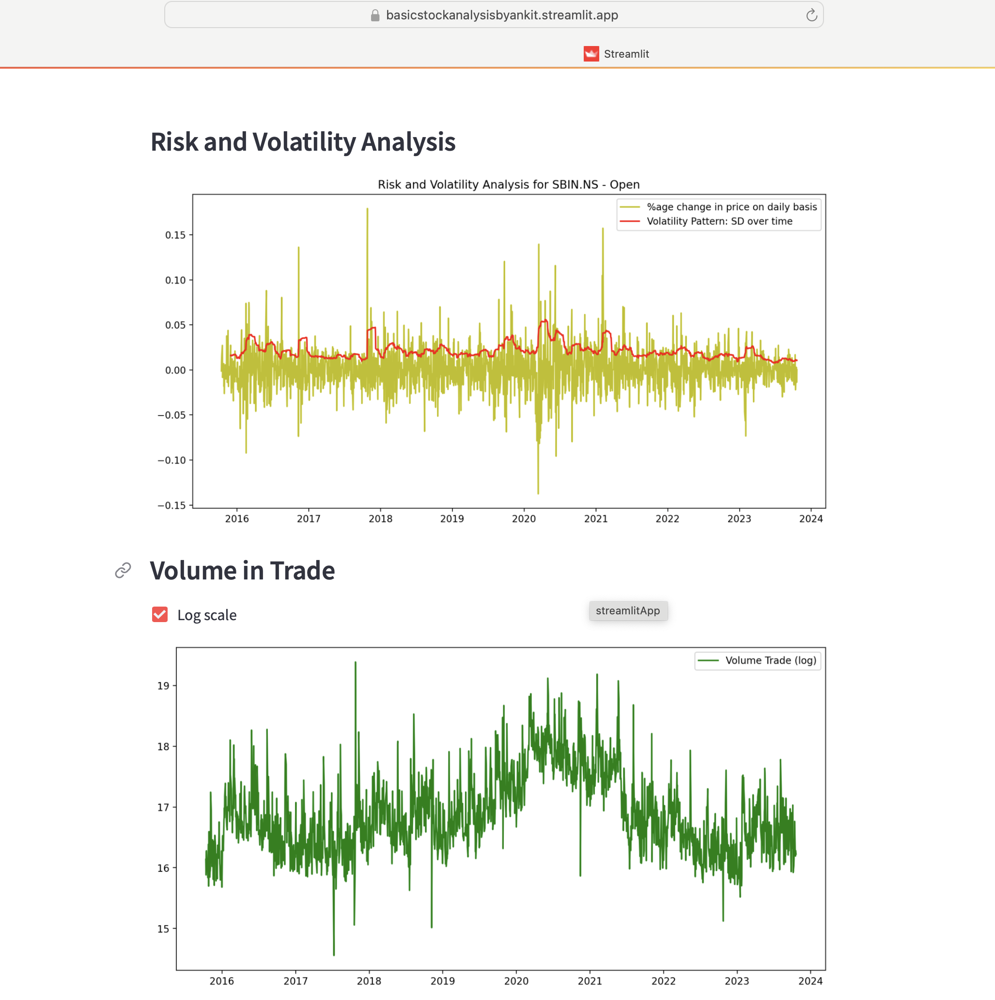

# 📈 Stock Market Analysis with Streamlit 📊

## Problem Statement
Understanding the dynamics of stock trends, risks, volatility, and trade volumes is crucial for informed investment decision-making. However, navigating the complexities of stock market data analysis can be daunting and time-consuming for the average user. Providing a user-friendly and interactive platform for stock market analysis can empower users to access and analyze such data seamlessly, facilitating well-informed investment decisions.

## Approach
This project aims to simplify the process of stock market analysis by leveraging the power of Python and the user-friendly Streamlit library. The application enables users to explore stock trends, risks, volatility, and trade volumes effortlessly.

## Data Source
The application dynamically retrieves real-time stock market data through the integration of the yfinance library, ensuring that users have access to the most up-to-date and accurate information for their preferred stocks. Users have the flexibility to input their desired stocks and choose specific date ranges for analysis, empowering them to conduct comprehensive and customized evaluations based on their specific investment interests and goals.

## Streamlit App
The Streamlit app provides users with the following functionalities:
- Selection of specific stocks and date ranges for comprehensive analysis.
- Interactive exploration of stock trends through dynamic line charts.
- Incorporation of dynamic Moving Average lines over the trend plot to offer deeper insights.
- Analysis of stock risks and volatility for better risk assessment.
- Clear visualization of trade volumes through interactive line graphs, enhancing user understanding.

## Glimpse of Streamlit App

**User Input for Stock Symbol**

**Selecting the Date Range**

**Choosing the Moving Average Window**

**Risk, Volatility Analysis and Volume Traded**

## Technologies Used
- Python
- Streamlit
- yfinance
- Numpy
- Matplotlib

## Way Forward
Future iterations of the app will incorporate additional features such as sentiment analysis, advanced technical indicators, and predictive modeling to enhance user experience and decision-making capabilities.

## Conclusion
By leveraging the capabilities of Streamlit and integrating it with powerful data analysis libraries, this application provides a seamless and user-friendly interface for users to gain valuable insights into the stock market. It aims to empower users to make informed investment decisions confidently and efficiently.

Feel free to explore the application and delve into the exciting world of stock market analysis!

[Streamlit_App_link](https://basicstockanalysisbyankit.streamlit.app)
[GitHub_Repository](https://github.com/AnkitBaliyan1/Stock_Analysis)